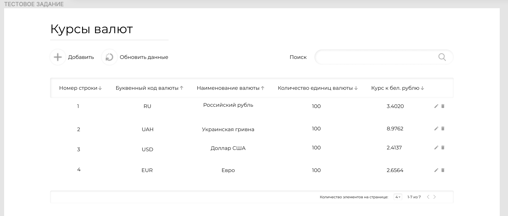
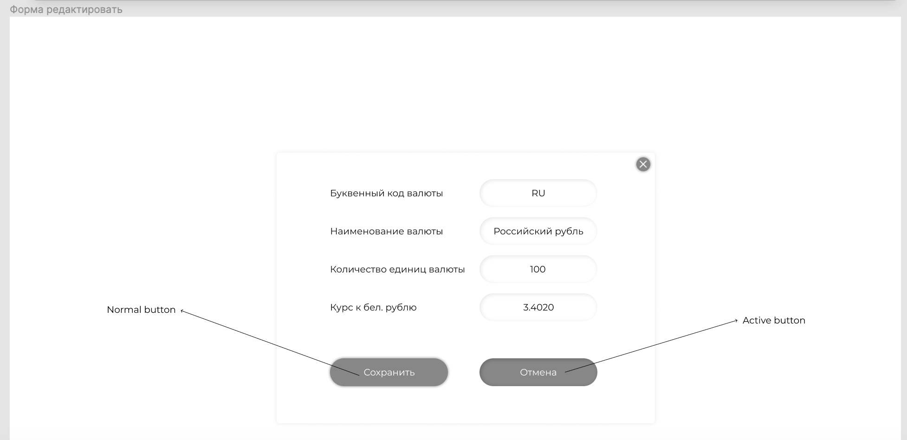
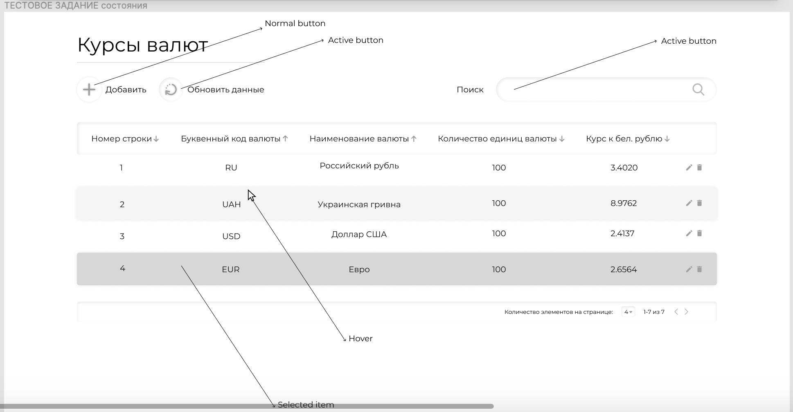

# bcstt
##Displays current exchange rates
###Technologies project
*** 
Vue, Vuetify, Pug/Jade, SCSS, Webpack, i18n, SessionStorage, Eslint, ENV, Babel, Webpack
***
### Project setup
```
npm install
```

### Compiles and hot-reloads for development
```
npm run serve
```
***
##Task
####Создать SPA приложение согласно макету, в котором будет реализовано:
➢Таблица, в которой будет указано:

    • номер строки;
    • Буквенный код валюты;
    • Наименование валюты;
    • Количество единиц валюты;
    • Курс к бел. рублю.
    
➢Таблица должна иметь следующие возможности:

    • Сортировать по нескольким полям;
    • Пагинация или «бесконечный» список (на выбор);
    • Поиск по содержимому таблицы;
    • Удалить запись из таблицы с подтверждением действия «Вы действительно хотите удалить запись?»;
    • Изменить запись в таблице из модального окна; 
    • Создать запись в таблице из модального окна; 
    • Обновить данные;
    • Хранить данные в сессии;

➢Данные для таблицы взять из любой открытой API с необходимой информацией.

➢Требования: для реализации задания использовать фреймворк Vuejs и библиотеки для него по желанию.

PS: Дизайна можно не придерживаться

➢[Ссылка на макет](<https://www.figma.com/file/6V3akQSZUS6TdHjwVHXMPZ/%D0%A2%D0%B5%D1%81%D1%82%D0%BE%D0%B2%D0%BE%D0%B5-%D0%B7%D0%B0%D0%B4%D0%B0%D0%BD%D0%B8%D0%B5?node-id=0%3A1>) или смотрите ниже или внутри папки 3 изображения.
***

***

***


***

